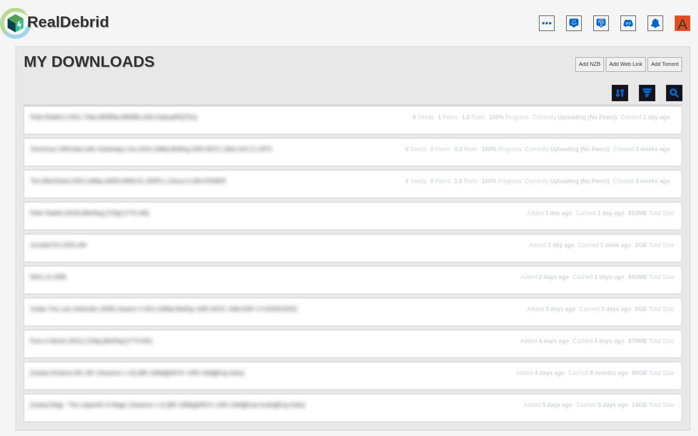

# TorBox Styles Collection

A collection of beautiful themes for TorBox dashboard, offering multiple color schemes and aesthetics. Transform your torrenting dashboard into a modern, eye-friendly interface with cohesive colors and interactive effects.

## Available Themes

| Theme                 | Description                                                   | Preview                                  | Install                                                                                                                                                          |
| --------------------- | ------------------------------------------------------------- | ---------------------------------------- | ---------------------------------------------------------------------------------------------------------------------------------------------------------------- |
| **Dark Blue**         | Dark theme with blue accents                                  |        | [](https://github.com/worldInColors/torbox-styles/raw/main/styles/torbox-dark-blue.user.css)         |
| **Catppuccin**        | Soft pastel theme inspired by Catppuccin color palette        |       | [](https://github.com/worldInColors/torbox-styles/raw/main/styles/torbox-catppuccin.user.css)      |
| **Amber**             | Warm amber theme with golden accents                          |            | [](https://github.com/worldInColors/torbox-styles/raw/main/styles/torbox-amber.user.css)           |
| **Light**             | Clean light theme for daytime usage                           |            | [](https://github.com/worldInColors/torbox-styles/raw/main/styles/torbox-light.user.css)        |
| **Deep Sea**          | A sophisticated dark theme with professional blues            |         | [](https://github.com/worldInColors/torbox-styles/raw/main/styles/torbox-deap-sea.user.css)      |
| **Fire Sunset**       | A bold fiery theme with deep reds and warm sunset colors      |      | [](https://github.com/worldInColors/torbox-styles/raw/main/styles/torbox-fire-sunset.user.css)        |
| **Forest Green**      | A natural forest-inspired theme with earth tones              |     | [](https://github.com/worldInColors/torbox-styles/raw/main/styles/torbox-forest-green.user.css)     |
| **Ocean Breeze**      | A crisp ocean-inspired theme with deep blues and cyan accents |     | [](https://github.com/worldInColors/torbox-styles/raw/main/styles/torbox-ocean-breeze.user.css)      |
| **Ocean Depths**      | A deep oceanic theme transitioning to mysterious purples      |     | [](https://github.com/worldInColors/torbox-styles/raw/main/styles/torbox-ocean-depths.user.css)  |
| **Onyx**              | A sleek theme inspired by Discord's Onyx dark theme           |             | [](https://github.com/worldInColors/torbox-styles/raw/main/styles/torbox-onyx.user.css)             |
| **Pastel Dreams**     | A dreamy pastel theme with soft colors                        |     | [](https://github.com/worldInColors/torbox-styles/raw/main/styles/torbox-pastel-dream.user.css)      |
| **Vivid Purple**      | A luxurious purple gradient theme with royal vibes            |  | [](https://github.com/worldInColors/torbox-styles/raw/main/styles/torbox-vivid-nightfall.user.css) |
| **Torbox But Better** | My personal favourite: RealDebrid                             |      | [](https://github.com/worldInColors/torbox-styles/raw/main/styles/torbox-but-better.user.css)       |

<br />

## Quick Installation

### One-Click Install (Recommended)

1. Install [Stylus](https://github.com/openstyles/stylus) browser extension
2. Click any "Install" button above for your preferred theme
3. Stylus will automatically open with the theme ready to install
4. Click "Install style" and you're done!

### Manual Installation

1. Install [Stylus](https://github.com/openstyles/stylus) or Stylish browser extension
2. Browse the [styles folder](./styles/) and choose your theme
3. Copy the CSS content and create a new style in your extension
4. Set the URL to apply to: `https://torbox.app/*`
5. Save and enjoy!

<br />

## Common Features

All themes include:

- **Complete dashboard theming** for the entire TorBox interface
- **Status-aware coloring** - different colors for active, cached, private, and ready downloads
- **Interactive hover effects** - subtle animations and visual feedback
- **Custom badge styling** - clearly distinguished torrent types and statuses
- **Consistent typography** - proper text hierarchy with optimized readability
- **Mobile-friendly** - responsive design that works on all devices

<br />

## Creating Custom Themes

Want to create your own theme or modify an existing one? Each theme uses CSS variables for easy customization:

```css
/* Example: Customizing the Dark Blue theme */
* {
  /* Change the accent color (used for icons and highlights) */
  --color-accent: #ff6b6b; /* Red accent instead of blue */

  /* Adjust background darkness */
  --color-bg: #2c3e50; /* Lighter background */
  --color-bg-alt: #3c5a78; /* Lighter secondary */

  /* Modify badge colors */
  --color-cached: #1abc9c; /* More green for cached */
  --color-badge-private: #e74c3c; /* Red for private */
}
```

### Color Palette Examples

Each theme has its unique color scheme:

- **Dark Blue**: Dark blues and grays
- **Catppuccin**: Soft pastels from the Catppuccin palette
- **Amber**: Warm golds and oranges
- **Light**: Clean whites and light blues
- **Deep Sea**: Professional blues and deep ocean tones
- **Fire Sunset**: Bold reds, oranges, and warm sunset hues
- **Forest Green**: Natural greens and earth tones
- **Ocean Breeze**: Deep blues and refreshing cyan accents
- **Ocean Depths**: Deep oceanic colors transitioning to mysterious purples
- **Onyx**: Sleek blacks and grays inspired by Discord
- **Pastel Dreams**: Soft, dreamy pastel colors
- **Vivid Purple**: Luxurious purples and royal gradients
- **Torbox But Better**: RealDebrid
  <br />

## Optional Features

> **💡 How to add optional features:** Copy any of the CSS code blocks below and paste them at the end of your chosen theme file in Stylus.

### Blur Effect on Hover

Blur download titles after 2 seconds of hovering:

```css
/* Blur effect on download titles */
[id^="headlessui-popover-button"] p.text-lg {
  filter: blur(0);
  transition: filter 0.3s;
  transition-delay: 2s;
}

[id^="headlessui-popover-button"]:hover p.text-lg {
  filter: blur(4px);
  transition-delay: 1s;
}
```

### Blur Titles Indefinitely

Always blur download titles:

```css
/* Indefinitely blur download titles */
[id^="headlessui-popover-button"] p.text-lg {
  filter: blur(4px);
  transition-delay: 1s;
}
```

**Best as a user style for easy togglability:** [](https://github.com/worldInColors/torbox-styles/raw/main/styles/other/blur-titles.user.css)

### Hide the sidebar

```css
/* Hide sidebar */
main {
  grid-template-columns: none !important;
}

div.relative.sidebar {
  display: none;
}
```

### Hide Specific UI Elements

Hide or show UI elements, like the "Explore Addons" or "Get Extra Time" buttons:

```css
/* Hide addons button */
a.rounded-md.p-2.w-full.bg-\[\#F59E0B\] {
  display: none !important;
}

/* Hide Get more time button */
a.rounded-md.p-2.w-full.bg-red-500 {
  display: none !important;
}
```

<br />

## Troubleshooting

**Theme not applying?**

- Make sure you're on `https://torbox.app/*` (themes work on all TorBox pages)
- Clear browser cache and refresh the page
- Check that your browser extension is enabled and the style is active

**Some elements not themed?**

- TorBox may have updated their CSS classes
- Try a different theme to see if it's theme-specific
- Right-click the element, inspect, and note the class names
- Open an issue with the details and screenshots

**Canvas graph still showing original colors?**

- Canvas elements can't be styled with CSS
- This is a known limitation - the graph colors are hardcoded in JavaScript

**Install button not working?**

- Make sure you have Stylus installed and enabled
- Try right-clicking the install link and selecting "Save link as" to download manually
- You can then import the .css file into Stylus

<br />

## Compatibility

- **Tested on:** Chrome, Firefox, Edge, Safari
- **TorBox Version:** Compatible with current version (August 2025)
- **Browser Extensions:** Stylus (recommended), Stylish, and other UserCSS-compatible extensions

<br />

## Contributing

Found an unthemed element, want to suggest improvements, or create a new theme? We'd love your help:

- **Report Issues:** Open an issue with screenshots and browser details
- **Submit Themes:** Create a pull request with your new theme in the `styles/` folder
- **Share Customizations:** Show off your color modifications in discussions
- **Suggest Features:** Request new themes or improvements

### Adding a New Theme

1. Fork the repository
2. Create a new `.user.css` file in the `styles/` folder
3. Follow the existing naming convention: `torbox-[theme-name].user.css`
4. Include proper UserCSS metadata at the top
5. Update this README with your theme in the table
6. Submit a pull request

<br />

## Acknowledgments

- Original Dark Blue theme inspired by [monkeytype.com](https://monkeytype.com)
- Catppuccin theme uses colors from the [Catppuccin](https://github.com/catppuccin/catppuccin) project

<br />

## Like what I do?

If you enjoy these themes and would like to support my work, consider buying me a coffee! ☕

[](https://ko-fi.com/nourm)

<br />

---

_Transform your TorBox experience with beautiful, functional themes._
